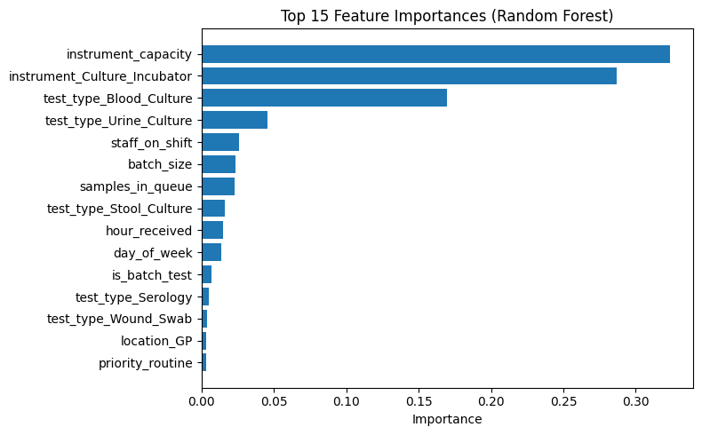
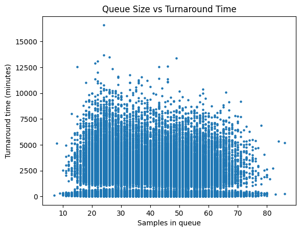
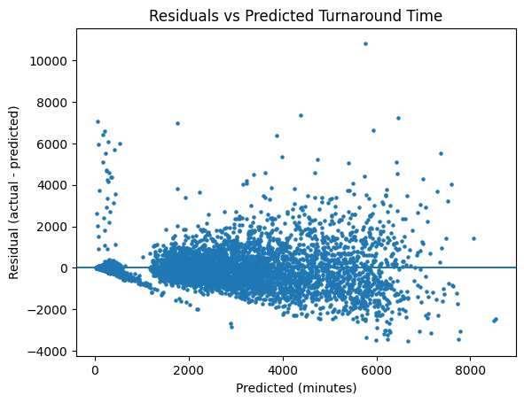

# Predicting Laboratory Test Turnaround Time (Regression)

This project explores how operational factors influence **laboratory test turnaround time (minutes)** using regression models. The goal is to understand which aspects of laboratory workflow most strongly drive delays, rather than to build a production ready system.

The work combines exploratory analysis with baseline and machine learning models to evaluate predictive performance and interpret key drivers of turnaround time.

---

## Dataset

This project uses a **synthetic dataset** designed to reflect realistic laboratory workflows.  
No patient or clinical data was used.

The dataset was generated programmatically to model common operational dynamics such as:
- test complexity
- staffing levels
- batching behaviour
- queue size
- instrument capacity
- shift and timing effects
- occasional rework and downtime

A data generation script is included (`src/make_synthetic_lab_data.py`) and can produce datasets with **1M+ rows**.  
A 50k-row sample was used for model development and evaluation.

### Key features
- `test_type`, `specimen_type`, `priority`, `location`
- `day_of_week`, `hour_received`, `shift`
- `staff_on_shift`, `samples_in_queue`, `batch_size`
- `instrument`, `instrument_capacity`
- Quality flags (e.g. contamination, insufficient sample)
- **Target:** `turnaround_time_minutes`

---

## Approach

1. **Exploratory Data Analysis**
   - Distribution of turnaround times
   - Relationship between queue size and delays

2. **Preprocessing**
   - One-hot encoding for categorical variables
   - Numerical features passed through unchanged

3. **Models**
   - Baseline (median predictor)
   - Ridge Regression
   - Random Forest Regression

4. **Evaluation Metrics**
   - Mean Absolute Error (MAE)
   - Root Mean Squared Error (RMSE)
   - R² score

---

## Results

### Model performance

| Model | MAE (minutes) | RMSE (minutes) | R² |
|------|---------------|----------------|----|
| Baseline (Median) | 1303.50 | 2219.89 | -0.375 |
| Ridge Regression | 389.18 | 720.56 | 0.855 |
| Random Forest | **336.47** | **700.81** | **0.863** |

The **Random Forest regressor** achieved the lowest error and highest R², indicating superior performance in capturing non-linear relationships within laboratory workflows.

---

## Key Observations

### Feature importance


Instrument-related constraints dominated model behaviour:
- **Instrument capacity**
- **Culture based tests** (e.g. blood and urine cultures)

These factors outweighed simpler workload indicators such as queue size.

---

### Queue size vs turnaround time


While increased queue size is associated with longer turnaround times, the relationship is noisy, suggesting that **capacity and test complexity** play a larger role than queue size alone.

---

### Residual analysis


Errors increase for extreme turnaround times, highlighting the difficulty of predicting rare but severe delays using standard regression models.

---

## Surprising Behaviour

Instrument capacity and culture related processes dominated model performance, while queue size and priority had a smaller impact than expected once capacity constraints were accounted for.

---

## Limitations & Future Work
- Data is synthetic and intended for modelling and analytical reasoning, not clinical decision-making.
- Evaluation is cross-sectional rather than time-aware.
- Future extensions could include:
  - time-series validation
  - service level target analysis
  - scenario simulation (e.g. staffing changes)

---

## How to run

## How to run

1) Install dependencies:
```bash
pip install -r requirements.txt

2) Generate the dataset:
python src/make_synthetic_lab_data.py

3) Open and run the notebook:
notebooks/01_lab_turnaround_regression.ipynb
